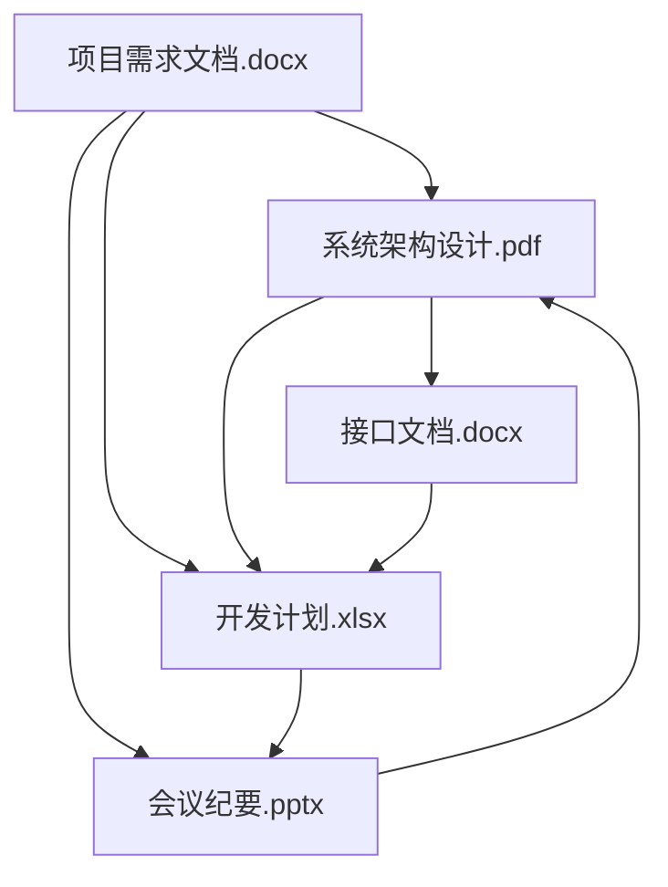

# 文档快速学习助手

> 输入 Word、PDF、PPT、Excel、TXT 等文档，自动提取核心内容，生成结构化摘要，理清文档之间的关系


## 需求描述

当面对大量文档时，快速理解每份文档的内容以及文档之间的关联关系是一个耗时的工作。
本工具旨在解决这个问题：**输入一个或多个文档，自动提取核心内容，生成摘要，分析文档之间的关系**，帮助用户快速掌握文档体系。

### 核心功能

1. **多格式支持** - 支持 Word (.docx)、PDF (.pdf)、PPT (.pptx)、Excel (.xlsx)、TXT (.txt) 等常见格式
2. **内容提取** - 自动提取文档中的标题、段落、表格、图片说明等关键信息
3. **智能摘要** - 使用 AI 生成文档核心内容摘要
4. **关系分析** - 分析文档之间的引用、依赖、补充等关系
5. **结构化展示** - 以清晰的结构展示文档内容和关系图谱


## 输入

| 参数 | 类型 | 必填 | 默认值 | 描述 |
|------|------|------|--------|------|
| `doc_path` | string | 是 | - | 文档路径（文件或目录） |
| `recursive` | boolean | 否 | true | 是否递归处理子目录 |
| `max_chars` | integer | 否 | 5000 | 每个文档最大提取字符数 |
| `summary_length` | integer | 否 | 300 | 摘要长度（字数） |
| `output_format` | string | 否 | md | 输出格式 (md/html/json) |
| `extract_images` | boolean | 否 | false | 是否提取图片中的文字 (OCR) |
| `extract_tables` | boolean | 否 | true | 是否提取表格内容 |
| `relationship_depth` | integer | 否 | 2 | 关系分析深度 |


## 输出

| 字段 | 说明 |
|------|------|
| `documents` | 文档列表及摘要 |
| `summary` | 整体摘要 |
| `relationships` | 文档关系图谱 |
| `topics` | 主题聚类 |
| `keywords` | 关键词提取 |
| `timeline` | 按时间排序（如有） |


## 使用示例

```bash
# 分析单个文档
python -m markflow.cli.commands execute doc_learner doc_path="./report.docx"

# 分析整个目录
python -m markflow.cli.commands execute doc_learner doc_path="./docs/"

# 指定摘要长度
python -m markflow.cli.commands execute doc_learner doc_path="./docs/" summary_length=200

# 生成 JSON 格式报告
python -m markflow.cli.commands execute doc_learner doc_path="./docs/" output_format="json"
```

## 输出示例

### 文档列表及摘要

| 文档 | 类型 | 摘要 | 关键词 |
|------|------|------|--------|
| 项目需求文档.docx | Word | 描述了项目背景、目标用户、核心功能模块和验收标准 | 需求、功能、验收 |
| 系统架构设计.pdf | PDF | 介绍了系统整体架构、技术选型、数据流和部署方案 | 架构、技术栈、部署 |
| 接口文档.docx | Word | 定义了 REST API 的端点、请求/响应格式和认证方式 | API、接口、认证 |
| 开发计划.xlsx | Excel | 包含各阶段任务、负责人、时间节点和里程碑 | 计划、进度、里程碑 |
| 会议纪要.pptx | PPT | 记录了项目启动会的讨论内容、决策和待办事项 | 会议、决策、待办 |

### 整体摘要
```text
本次分析共处理 5 份文档，涵盖项目从需求到实施的全流程：

需求阶段：项目需求文档.docx 明确了业务目标

设计阶段：系统架构设计.pdf 提供了技术方案

开发阶段：接口文档.docx 和 开发计划.xlsx 指导具体实施

管理阶段：会议纪要.pptx 记录了过程决策

核心主题：项目交付、技术架构、进度管理
```

### 关系图（Mermaid）



### 文档关系图谱

```text
项目需求文档.docx
    ├── 引用 → 系统架构设计.pdf (需求驱动架构设计)
    ├── 引用 → 开发计划.xlsx (需求决定任务范围)
    └── 补充 → 会议纪要.pptx (需求变更记录)

系统架构设计.pdf
    ├── 引用 → 接口文档.docx (架构定义接口规范)
    ├── 引用 → 开发计划.xlsx (架构影响开发排期)
    └── 依赖 → 项目需求文档.docx (需求是架构输入)

接口文档.docx
    ├── 依赖 → 系统架构设计.pdf (遵循架构设计)
    └── 补充 → 开发计划.xlsx (接口开发任务)

开发计划.xlsx
    ├── 依赖 → 项目需求文档.docx (需求决定任务)
    ├── 依赖 → 系统架构设计.pdf (架构决定技术方案)
    └── 引用 → 会议纪要.pptx (计划调整依据)

会议纪要.pptx
    ├── 引用 → 项目需求文档.docx (讨论需求)
    ├── 引用 → 开发计划.xlsx (调整计划)
    └── 补充 → 系统架构设计.pdf (架构讨论)
```

### 主题聚类

| 主题 | 文档 | 相关度 |
|------|------|--------|
| 需求管理 | 项目需求文档.docx, 会议纪要.pptx | 高 |
| 技术架构 | 系统架构设计.pdf, 接口文档.docx | 高 |
| 项目管理 | 开发计划.xlsx, 会议纪要.pptx | 高 |

### 关键词提取

| 关键词 | 出现次数 | 来源文档 |
|--------|----------|----------|
| 需求 | 15 | 项目需求文档.docx, 会议纪要.pptx |
| 架构 | 12 | 系统架构设计.pdf, 接口文档.docx |
| API | 10 | 接口文档.docx |
| 里程碑 | 8 | 开发计划.xlsx |
| 部署 | 6 | 系统架构设计.pdf |

## 配置文件示例

```json
{
  "doc_path": "./docs/",
  "recursive": true,
  "max_chars": 5000,
  "summary_length": 300,
  "output_format": "md",
  "extract_images": false,
  "extract_tables": true,
  "relationship_depth": 2
}
```

## 依赖安装

```bash
pip install python-docx PyPDF2 python-pptx openpyxl pillow pytesseract
```

## 输出位置

生成的报告保存在 `skills/doc_learner/output/` 目录下。

| 路径 | 说明 |
|------|------|
| `skills/doc_learner/output/report.md` | Markdown 格式报告 |
| `skills/doc_learner/output/report.json` | JSON 格式报告 |
| `skills/doc_learner/output/relationships.md` | 关系图谱 |
| `skills/doc_learner/output/summary.md` | 整体摘要 |