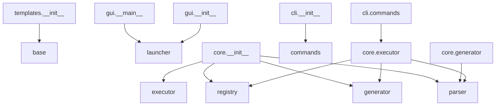

# code_relations_presents

> 输入代码目录，自动生成代码结构分析报告，展示模块关系、函数调用链和架构概览


## 概览

- **文件数**: 1
- **类数**: 1
- **方法数**: 18
- **函数数**: 0


## 技能描述

代码关系分析报告生成器，自动分析 Python 代码目录，生成结构化的代码关系文档，帮助开发者快速理解代码架构。

### 核心功能

- 📁 **目录结构可视化** - 以树形结构展示项目目录，带文件描述
- 🔗 **模块依赖分析** - 区分内部/外部依赖，展示模块间的引用关系
- 📊 **核心模块识别** - 自动标记被引用最多的核心模块
- 📋 **模块引用矩阵** - 显示每个模块被谁引用
- 📈 **依赖关系图** - 生成 Mermaid 格式的可视化依赖图
- 🔄 **函数调用关系** - 展示主要函数之间的调用链
- 📐 **类继承关系** - 展示类的继承结构
- 📊 **代码统计** - 文件数、代码行数、注释率统计
- 🚀 **入口文件识别** - 自动标记包含 `if __name__ == "__main__"` 的入口文件


## 输入

| 参数 | 类型 | 必填 | 默认值 | 描述 |
|------|------|------|--------|------|
| `code_path` | string | 是 | - | 要分析的代码目录路径 |
| `output_format` | string | 否 | md | 输出格式 (md/json) |
| `max_depth` | integer | 否 | 5 | 目录树最大深度 |
| `include_tests` | boolean | 否 | false | 是否包含测试目录 |
| `show_private` | boolean | 否 | false | 是否显示私有函数/方法 |


## 输出

| 字段 | 说明 |
|------|------|
| `report_path` | 报告文件路径 |
| `name` | 项目名称 |
| `total_files` | 总文件数 |
| `entry_points` | 入口文件列表 |
| `core_modules` | 核心模块列表（被引用最多） |
| `generated_at` | 生成时间 |


## 使用示例

```bash
# 分析当前项目
python -m markflow.cli.commands execute code_relations_presents code_path="."

# 分析指定目录
python -m markflow.cli.commands execute code_relations_presents code_path="./skills"

# 生成 JSON 格式报告
python -m markflow.cli.commands execute code_relations_presents code_path="." output_format="json"

# 包含测试目录
python -m markflow.cli.commands execute code_relations_presents code_path="." include_tests=true

# 显示私有函数
python -m markflow.cli.commands execute code_relations_presents code_path="." show_private=true

# 查看完整参数说明：
python -m markflow.cli.commands info code_relations_presents
```

# 输出示例

以下是对 MarkFlow 项目自身的分析报告示例：

## 目录结构

```text
├── __init__.py  # MarkFlow - 从Markdown到可执行技能的工作流
├── 📁 cli/
│   ├── __init__.py  # 命令行接口模块
│   └── commands.py  # 命令行工具
├── 📁 core/
│   ├── __init__.py  # 核心模块
│   ├── executor.py  # 技能执行器 - 执行和管理技能
│   ├── generator.py  # 代码生成器 - 从SkillSpec生成可执行代码
│   ├── parser.py  # Markdown解析器 - 从Markdown提取技能规格
│   └── registry.py  # 技能注册中心 - 管理和注册技能
├── 📁 gui/
│   ├── __init__.py  # GUI 模块 - MarkFlow 图形化界面
│   ├── __main__.py  # GUI 入口点
│   └── launcher.py  # MarkFlow GUI 启动器 - 统一管理所有技能
├── 📁 templates/
│   ├── __init__.py  # 模板模块
│   ├── base.py  # 模板管理器 - 管理技能模板
│   └── 📁 skills/
│       ├── base_temp.md  # Markdown 文档
│       ├── code_relations_presents.md  # Markdown 文档
│       ├── code_reviewer.md  # Markdown 文档
│       ├── doc_generator.md  # Markdown 文档
│       ├── fast_doc_point_learner.md  # Markdown 文档
│       ├── image_toolbox.md  # Markdown 文档
│       ├── image_viewer.md  # Markdown 文档
│       ├── language_learner.md  # Markdown 文档
│       ├── music_player.md  # Markdown 文档
│       ├── news_aggregator.md  # Markdown 文档
│       ├── novel_writer_ollama.md  # Markdown 文档
│       ├── README_TEMPLATE.md  # Markdown 文档
│       ├── sd_image_generator.md  # Markdown 文档
│       └── voice_assistant.md  # Markdown 文档
└── 📁 utils/
    └── code_collect.py  # 代码收集器 - 收集项目代码，生成汇总报告、打包或生成单一 
```

## 入口文件

- 🚀 `cli\commands.py`
- 🚀 `gui\launcher.py`
- 🚀 `gui\__main__.py`
- 🚀 `utils\code_collect.py`

## 核心模块（被引用最多）

| 排名 | 模块 | 被引用次数 |
|------|------|------------|
| 1 | `parser` | 3 |
| 2 | `registry` | 2 |
| 3 | `generator` | 2 |
| 4 | `launcher` | 2 |
| 5 | `core.executor` | 1 |
| 6 | `commands` | 1 |
| 7 | `executor` | 1 |
| 8 | `base` | 1 |

## 模块引用矩阵

| 模块 | 被引用次数 | 被以下模块引用 |
|------|------------|----------------|
| `parser` | 3 | `core.executor`, `core.generator`, `core.__init__` |
| `registry` | 2 | `core.executor`, `core.__init__` |
| `generator` | 2 | `core.executor`, `core.__init__` |
| `launcher` | 2 | `gui.__init__`, `gui.__main__` |
| `core.executor` | 1 | `cli.commands` |
| `commands` | 1 | `cli.__init__` |
| `executor` | 1 | `core.__init__` |
| `base` | 1 | `templates.__init__` |

## 依赖关系图（Mermaid）



## 代码统计

| 指标 | 数量 |
|------|------|
| 总文件数 | 28 |
| Python 文件 | 14 |
| 总行数 | 2888 |
| 代码行数 | 2138 |
| 注释行数 | 288 |
| 空白行数 | 462 |

**注释率**: 10.0%

## 模块依赖关系

### `cli.__init__`

**内部依赖**:
  - `commands`

### `cli.commands`

**内部依赖**:
  - `core.executor`

**外部依赖**:
  - `argparse`
  - `sys`
  - `pathlib`
  - `json`
  - `rich.console`
  - ... 还有 9 个

### `core.__init__`

**内部依赖**:
  - `parser`
  - `generator`
  - `registry`
  - `executor`

### `core.executor`

**内部依赖**:
  - `registry`
  - `generator`
  - `parser`

**外部依赖**:
  - `typing`
  - `pathlib`
  - `logging`

### `core.generator`

**内部依赖**:
  - `parser`

**外部依赖**:
  - `typing`
  - `re`

### `core.parser`

**外部依赖**:
  - `re`
  - `dataclasses`
  - `typing`
  - `pathlib`

### `core.registry`

**外部依赖**:
  - `typing`
  - `pathlib`
  - `importlib`
  - `importlib.util`
  - `json`
  - ... 还有 1 个

### `gui.__init__`

**内部依赖**:
  - `launcher`

### `gui.__main__`

**内部依赖**:
  - `launcher`

### `gui.launcher`

**外部依赖**:
  - `tkinter`
  - `tkinter`
  - `pathlib`
  - `threading`
  - `sys`
  - ... 还有 8 个

### `templates.__init__`

**内部依赖**:
  - `base`

### `templates.base`

**外部依赖**:
  - `typing`
  - `pathlib`

### `utils.code_collect`

**外部依赖**:
  - `os`
  - `json`
  - `hashlib`
  - `zipfile`
  - `pathlib`
  - ... 还有 3 个

## 函数调用关系

### `cli.commands`

| 函数 | 调用的函数 |
|------|------------|
| `main` | `ArgumentParser`, `add_subparsers`, `add_parser`, `add_argument`, `add_argument` |
| `build_skill` | `Path`, `exists`, `exit`, `build_from_file`, `get` |
| `execute_skill` | `insert`, `import_module`, `dir`, `skill_class`, `items` |
| `list_skills` | `Path`, `exists`, `list_skills`, `load_from_directory`, `Table` |
| `show_info` | `get`, `get`, `get`, `get`, `get` |
| ... | 还有 2 个函数 |

### `core.executor`

| 函数 | 调用的函数 |
|------|------------|
| `execute` | `get_instance`, `execute`, `error` |
| `execute_from_markdown` | `parse`, `generate`, `_register_generated_skill`, `execute` |
| `build_from_markdown` | `parse`, `generate`, `_register_generated_skill`, `save_to_file` |
| `build_from_file` | `build_from_markdown`, `read` |
| `reload_skill` | `unregister`, `exists`, `load_from_file` |

### `core.generator`

| 函数 | 调用的函数 |
|------|------------|
| `generate` | `_generate_class_name`, `_generate_class_code`, `_generate_metadata` |

### `core.parser`

| 函数 | 调用的函数 |
|------|------------|
| `parse` | `split`, `_extract_title`, `_extract_sections`, `SkillSpec`, `_extract_section_content` |
| `parse_file` | `parse`, `read` |

### `core.registry`

| 函数 | 调用的函数 |
|------|------------|
| `register` | `info` |
| `unregister` | `info` |
| `get` | `KeyError` |
| `create_instance` | `get`, `skill_class` |
| `get_instance` | `create_instance` |
| ... | 还有 5 个函数 |

### `gui.launcher`

| 函数 | 调用的函数 |
|------|------------|
| `main` | `MarkFlowLauncher`, `run` |
| `run` | `execute`, `after`, `after`, `_show_result`, `_show_error` |

### `templates.base`

| 函数 | 调用的函数 |
|------|------------|
| `list_templates` | `get`, `items` |
| `get_template` | `get` |
| `render` | `get_template`, `items`, `ValueError`, `format`, `format` |
| `add_template` | `_save_template` |

### `utils.code_collect`

| 函数 | 调用的函数 |
|------|------------|
| `main` | `ArgumentParser`, `add_argument`, `add_argument`, `add_argument`, `add_argument` |
| `collect` | `walk`, `keys`, `_should_ignore`, `lower`, `append` |
| `export_txt` | `append`, `append`, `append`, `append`, `append` |
| `pack_to_zip` | `strftime`, `ZipFile`, `write`, `writestr`, `now` |
| `export_json` | `dump`, `isoformat`, `now` |
| ... | 还有 1 个函数 |

---

*报告由 CodeRelationsPresents 生成于 2026-08-25T10:45:13.385876*


## 输出位置

生成的报告保存在 `skills/code_relations_presents/output/` 目录下。

| 路径 | 说明 |
|------|------|
| `skills/code_relations_presents/output/{name}_{timestamp}.md` | Markdown 格式报告 |
| `skills/code_relations_presents/output/{name}_{timestamp}.json` | JSON 格式报告 |


## 依赖

- Python 3.8+
- 无第三方依赖（仅使用标准库）


## 适用场景

- **接手新项目** - 快速了解代码结构
- **代码审查** - 查看模块依赖关系
- **重构准备** - 识别核心模块和依赖
- **文档生成** - 自动生成架构文档
- **团队协作** - 共享项目架构视图


## 相关技能

| 技能 | 说明 |
|------|------|
| `doc_generator` | 从代码生成 API 文档 |
| `code_gen_from_md` | 从 Markdown 生成代码 |

---